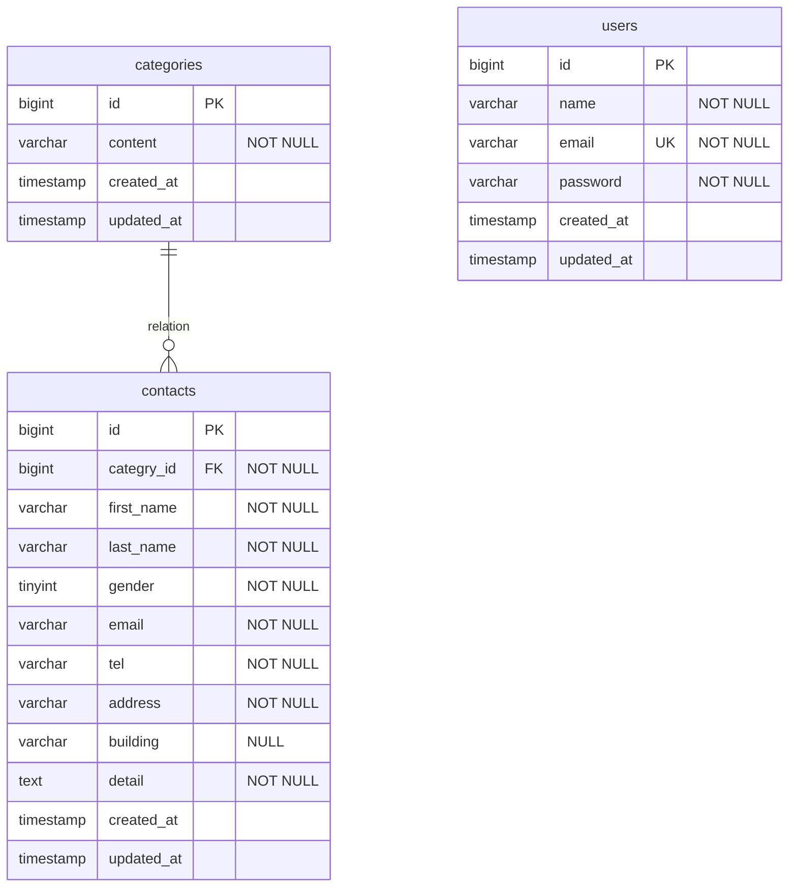

# FashionablyLate

お問い合わせフォームと管理画面を備えたLaravelアプリケーションです。

## 環境構築

※ 2026年6月12日に、GitHubからcloneした環境で動作確認しながら手順を完成させます。

1. リポジトリをclone
2. `.env.example`から`.env`を作成
3. Composerパッケージをインストール
4. Dockerコンテナを起動
5. APP_KEYを生成
6. データベース設定
7. マイグレーションとシーディングを実行

## 使用技術

- PHP 8.5
- Laravel 10
- Laravel Fortify
- MySQL 8.4
- Docker
- Laravel Sail

※ バージョンは最終確認後に修正します。

## ER図

## URL

- お問い合わせフォーム：`http://localhost/`
- 管理画面：`http://localhost/admin`
- 会員登録：`http://localhost/register`
- ログイン：`http://localhost/login`
